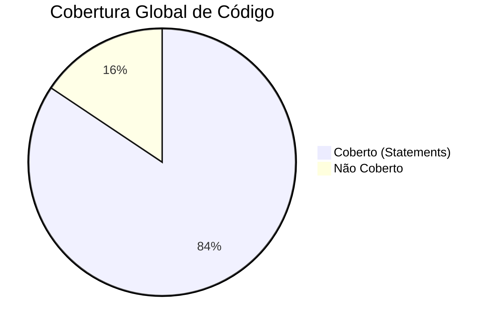

# 📊 Relatório Técnico de Desenvolvimento - Gestão Escolar

Este relatório detalha a implementação do projeto de Gestão Escolar, organizado conforme a estrutura e os critérios de avaliação definidos no desafio oficial.

---

## 🏗️ 1. Estrutura do Projeto (Requisitos Mínimos)

O projeto foi construído sobre uma base moderna e resiliente, atendendo integralmente às versões e ferramentas solicitadas.

### **1.1. Core Tecnológico**
- **Expo SDK 55.0.19**: Versão superior à mínima exigida (SDK 54).
- **React 19 / RN 0.83.6**: Utilização das versões mais estáveis para o novo Codegen e performance otimizada.
- **TypeScript**: Tipagem rigorosa de entidades, hooks e componentes (Ref: `src/types/`).
- **Navegação (Expo Router)**: Implementação baseada em arquivos na pasta `app/`.
- **UI & Styling**: **Gluestack UI** e **NativeWind v4** (Tailwind CSS).
  - **Design System Engine**: Adoção da arquitetura moderna onde o `GluestackUIProvider` (Ref: `app/_layout.tsx`) atua como o motor de orquestração de temas.
  - **Consumo de Tokens**: Em vez de componentes pesados, utiliza-se a abordagem *performance-first* com tokens de design (ex: `bg-primary`, `text-destructive`) orquestrados pelo Gluestack.
  - **Exemplo de Componente**: Uso de tipografia específica do Gluestack no componente `LanguagePicker.tsx` (Ref: `import { Text } from "@gluestack-ui/nativewind"`).
  - **Motivação (Anti-Lock-in)**: Esta arquitetura desacoplada evita que o projeto fique preso a uma biblioteca de componentes específica. A UI depende de *tokens* (abstrações) e não de implementações, permitindo trocar o motor de design no futuro sem refatoração massiva da interface.
- **Gerenciamento de Estado**: **Zustand** com persistência (Ref: `src/store/useSchoolStore.ts`).

### **1.2. Simulação de Back-end**
- **MirageJS**: Configuração de servidor de mock em `src/mocks/server.ts`.
- **Endpoints**: Implementação de rotas CRUD para `/schools` e `/classes`.
- **Modelagem**: Relacionamento de associação onde cada escola possui múltiplas turmas vinculadas (Ref: `src/mocks/server.ts` -> `models`).

---

## ⚙️ 2. Funcionalidades Entregues (Requisitos Mínimos)

### **2.1. Módulo de Escolas**
- **Listagem**: Visualização completa com nome, endereço e contagem dinâmica de turmas (Ref: `app/index.tsx`).
- **Cadastro e Edição**: Formulários validados com campos obrigatórios (Ref: `app/school/new.tsx` e `app/school/[id]/edit.tsx`).
- **Exclusão**: Remoção segura de registros através de modais adaptativos (Ref: `src/components/ConfirmationModal.tsx`).

### **2.2. Módulo de Turmas**
- **Listagem Contextual**: Filtragem automática baseada na escola selecionada (Ref: `app/school/[id]/index.tsx`).
- **Cadastro e Gestão**: Controle total de turnos, nome da turma e ano letivo (Ref: `app/school/[id]/class/new.tsx`).

---

## 🔍 3. Extras (Diferenciais)

### **3.1. Busca e Filtro**
- Implementação de filtros em tempo real nas listagens (Ref: `src/hooks/useSchools.ts` -> lógica de `setSearchQuery`).

### **3.2. Layout Responsivo**
- Interface adaptativa para Mobile e Tablet, utilizando as capacidades do NativeWind (Ref: `tailwind.config.js`).

### **3.3. Componentização e Hooks**
- **Abstração de Lógica**: Uso de hooks personalizados para separar a lógica de negócio da interface (Ref: `src/hooks/useSchools.ts` e `src/hooks/useClasses.ts`).

### **3.4. Armazenamento Offline**
- Uso de **AsyncStorage** integrado ao Zustand para garantir que os dados do mock persistam entre sessões (Ref: `src/store/useSchoolStore.ts` -> middleware `persist`).

### **3.5. Testes Unitários**
- ✅ **35 Testes Unitários Passando** (Jest + RTL), cobrindo stores, componentes, telas e funcionalidades de busca com excelência.
- **Métricas de Cobertura (Snapshot)**:



| Métrica | Cobertura |
| :--- | :--- |
| **Statements** | 84.38% |
| **Lines** | 84.41% |
| **Functions** | 71.69% |
| **Branches** | 59.91% |

---

## 💡 4. Critérios de Avaliação

### **4.1. Organização e Qualidade (SOLID / Clean Code)**
- **SRP (Single Responsibility)**: Hooks com responsabilidades únicas (Ex: `useSchools.ts`).
- **DIP (Dependency Inversion)**: Telas dependem de abstrações (hooks), não de implementações de rede (Ref: `app/index.tsx` consumindo `useSchools`).
- **Clean Code**: Nomenclatura semântica e funções modulares (Ex: `handleDeleteSchool` em `app/index.tsx`).

> **Nota Técnica (UI Decoupling)**: A interface foi construída seguindo o princípio de **Inversão de Dependência**. Ao consumir o Gluestack como um motor de tokens via NativeWind, garantimos que a lógica visual não esteja acoplada a componentes proprietários, permitindo uma evolução tecnológica fluida e performante.

> **Nota Técnica (Hooks-as-a-Service)**: O projeto adota o padrão de *Custom Hooks* como a camada primária de serviço e orquestração. Esta é uma decisão de design consciente e coerente com o escopo do desafio proposto. Embora em projetos de médio/grande porte a utilização de uma *Service Layer* tradicional seja o padrão recomendado para desacoplamento extremo, para este contexto, a estratégia atual simplifica a arquitetura sem sacrificar a testabilidade ou a reatividade.

### **4.2. Usabilidade e Design**
- Interface fluida e responsiva com suporte completo a **temas Light e Dark**, estabilizados via controle de estado manual (Ref: `src/store/useThemeStore.ts`).

### **4.3. Versionamento (Git)**
- Uso do padrão [**Conventional Commits**](https://www.conventionalcommits.org/en/v1.0.0/) (feat, fix, docs, chore) para um histórico de projeto profissional e semântico.

### **4.4. Instruções (README)**
- Documentação completa na raiz do projeto, detalhando instalação, execução e testes (Ref: `README.md`).

---

## 🚀 5. Dicas e diferenciais

Nesta seção, destacamos o uso de técnicas avançadas e padrões de design que elevam a qualidade do projeto conforme sugerido no desafio.

- **TypeScript Avançado**: Tipagem rigorosa em toda a camada de dados e lógica (Ref: `src/types/index.ts`).
- **Design Patterns**: Implementação de padrões como **Repository** (Hooks) e **Adapter** (Store) para isolamento de camadas.
- **Organização Modular**: Estrutura organizada por domínios e features (Pastas: `src/store`, `src/hooks`, `src/components`).
- **Lint / Formatter**: Padronização de código via ESLint e Prettier (Ref: `.eslintrc.js`).

---

## 💎 6. Adicionais (Expansion)

Funcionalidades extras implementadas para demonstrar escalabilidade, segurança e robustez.

- **Login Keycloak (OIDC)**: Integração para autenticação segura (Ref: `src/context/AuthContext.tsx`).
- **Internacionalização (i18n)**: Suporte bilíngue (Português/Inglês) (Ref: `src/i18n/index.ts`).
- **Paginação (Infinite Scroll)**: Otimização de performance para grandes volumes de dados (Ref: `src/hooks/useSchools.ts` -> lógica de `fetchNextPage`).

---

## 🏗️ 7. Decisões Arquiteturais: UI Decoupling

Esta seção detalha a escolha da arquitetura de interface, que prioriza o desacoplamento e a manutenibilidade a longo prazo.

### **7.1. O Problema: Acoplamento (Vendor Lock-in)**
Em abordagens tradicionais (como Gluestack v1 ou NativeBase), o desenvolvedor utiliza componentes proprietários que "prendem" o projeto à biblioteca:

```tsx
// Exemplo de Abordagem Tradicional (Acoplada)
import { Button, ButtonText, Box } from "@gluestack-ui/themed";

<Box p="$4" bg="$white">
  <Button action="primary" size="lg">
    <ButtonText>Salvar Escola</ButtonText>
  </Button>
</Box>
```
*Risco*: Qualquer mudança drástica na biblioteca exige uma refatoração completa de todas as telas da aplicação.

### **7.2. A Solução: Gluestack + NativeWind (Headless UI)**
Optamos pela abordagem de **Headless UI**, onde o Gluestack atua exclusivamente como o motor do *Design System* (Tokens), e a aplicação ocorre via Tailwind CSS (NativeWind):

```tsx
// Exemplo de Abordagem Utilizada (Desacoplada)
import { View, TouchableOpacity, Text } from "react-native";

<View className="p-4 bg-background">
  <TouchableOpacity className="bg-primary p-4 rounded-2xl items-center">
    <Text className="text-white font-bold text-lg">Salvar Escola</Text>
  </TouchableOpacity>
</View>
```

### **7.3. Vantagens Estratégicas**
1.  **Independência de Engine**: Caso seja necessário trocar o motor de design no futuro (ex: migrar para **Tamagui**, **Shopify Restyle**, **Unistyles**, ou bibliotecas clássicas como **React Native Paper** e **NativeBase**), basta remapear os tokens no `tailwind.config.js` ou no Provider, sem tocar no código das telas.
2.  **Performance Máxima**: Menos camadas de abstração na árvore de renderização do React Native.
3.  **Consistência via Tokens**: A consistência visual é garantida por contratos (tokens como `primary`, `card`, `destructive`) e não por componentes rígidos.

---


